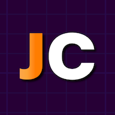
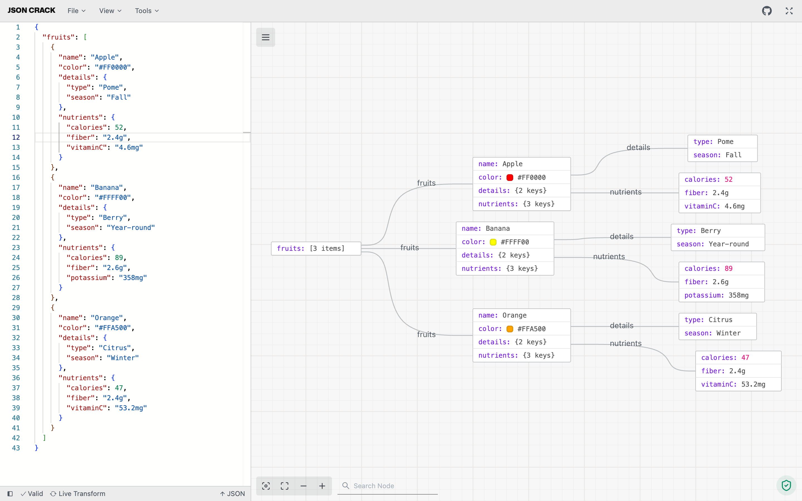

> [!NOTE]
> **This is a personal fork of [AykutSarac/jsoncrack.com](https://github.com/AykutSarac/jsoncrack.com) for personal use only.**
> It serves as an experiment to migrate the project to [Bun](https://bun.sh/).
> This fork is not intended for redistribution or production use beyond personal purposes.
>
> Huge thanks to [Aykut Saraç](https://github.com/AykutSarac) for creating and maintaining JSON Crack — a truly great piece of open-source software.
>
> The original project is licensed under the [Apache License 2.0](https://github.com/AykutSarac/jsoncrack.com/blob/main/LICENSE.md), Copyright 2025 Aykut Saraç.

<!-- PROJECT LOGO -->
<p align="center">
  <a href="https://github.com/AykutSarac/jsoncrack.com">
   
  </a>

  <h1 align="center">JSON Crack</h1>

  <p align="center">
    The open-source JSON Editor.
    <br />
    <a href="https://jsoncrack.com"><strong>Learn more »</strong></a>
    <br />
    <br />
    <a href="https://discord.gg/yVyTtCRueq">Discord</a>
    ·
    <a href="https://jsoncrack.com">Website</a>
    ·
    <a href="https://github.com/AykutSarac/jsoncrack.com/issues">Issues</a>
    ·
  </p>
</p>

<!-- ABOUT THE PROJECT -->

## About the Project



## Visualize JSON into interactive graphs

JSON Crack is a tool for visualizing JSON data in a structured, interactive graphs, making it easier to explore, format, and validate JSON. It offers features like converting JSON to other formats (CSV, YAML), generating JSON Schema, executing queries, and exporting visualizations as images. Designed for both readability and usability.

* **Visualizer**: Instantly convert JSON, YAML, CSV, and XML into interactive graphs or trees in dark or light mode.
* **Convert**: Seamlessly transform data formats, like JSON to CSV or XML to JSON, for easy sharing.
* **Format & Validate**: Beautify and validate JSON, YAML, and CSV for clear and accurate data.
* **Code Generation**: Generate TypeScript interfaces, Golang structs, and JSON Schema.
* **JSON Schema**: Create JSON Schema, mock data, and validate various data formats.
* **Advanced Tools**: Decode JWT, randomize data, and run jq or JSON path queries.
* **Export Image**: Download your visualization as PNG, JPEG, or SVG.
* **Privacy**: All data processing is local; nothing is stored on our servers.

## Recognition

<a href="https://news.ycombinator.com/item?id=32626873">
  
</a>

<a href="https://producthunt.com/posts/JSON-Crack?utm_source=badge-featured&utm_medium=badge&utm_souce=badge-jsoncrack" target="_blank"></a>

## Integrations

- [npm Package (`jsoncrack-react`)](https://www.npmjs.com/package/jsoncrack-react)

## Contributing

- Found a bug or missing feature? Open an issue on [GitHub Issues](https://github.com/AykutSarac/jsoncrack.com/issues).
- Want to contribute code or docs? Start with our [contribution guide](./CONTRIBUTING.md).

## Stay Up-to-Date

JSON Crack officially launched as v1.0 on the 17th of February 2022 and we've come a long way so far. Watch **releases** of this repository to be notified of future updates:

<a href="https://github.com/AykutSarac/jsoncrack.com"></a>

<!-- GETTING STARTED -->

## Getting Started

To get a local copy up and running, please follow these simple steps.

### Prerequisites

- [mise](https://mise.jdx.dev/) (recommended) — automatically installs the correct Bun version
- Or [Bun](https://bun.sh/) >= 1.2 installed manually

### Setup

1. Clone the repo (or fork https://github.com/AykutSarac/jsoncrack.com/fork):

   ```sh
   git clone https://github.com/AykutSarac/jsoncrack.com.git
   cd jsoncrack.com
   ```

2. Install tools and dependencies:

   ```sh
   # If using mise (installs Bun automatically via mise.toml):
   mise install
   mise run install

   # Or manually:
   bun install
   ```

3. Run the development server:

   ```sh
   mise run dev    # or: bun run dev
   ```

   The editor will be available at `http://localhost:3000/`.

### Mise Tasks

This project includes [mise](https://mise.jdx.dev/) tasks as shortcuts for common operations:

| Command | Description |
| --- | --- |
| `mise run install` | Install dependencies |
| `mise run dev` | Start development server |
| `mise run build` | Build all packages |
| `mise run lint` | Run linting |
| `mise run lint:fix` | Fix lint issues |
| `mise run start` | Start production server |
| `mise run clean` | Clean build outputs |
| `mise run dc:validate` | Validate compose config |
| `mise run dc:up` | Start services (pre-built image) |
| `mise run dc:down` | Stop and remove containers |
| `mise run dc:status` | Show container status |
| `mise run dc:logs` | Tail container logs |
| `mise run dc:build:up` | Build from source and start |
| `mise run dc:build:rec` | Rebuild from source and recreate |
| `mise run dc:build:down` | Stop source-built containers |
| `mise run dc:prune` | Nuclear cleanup: containers, images |

### Environment Variables

Copy the example env file and adjust as needed:

```sh
cp apps/www/.env.example apps/www/.env
```

| Variable | Default | Description |
| --- | --- | --- |
| `NEXT_PUBLIC_NODE_LIMIT` | `10000` | Maximum number of nodes rendered in the graph |
| `NEXT_TELEMETRY_DISABLED` | `1` | Disable Next.js telemetry |
| `NEXT_PUBLIC_DISABLE_EXTERNAL_MODE` | `true` | Disable the external mode dialog |
| `NEXT_PUBLIC_GA_MEASUREMENT_ID` | _(empty)_ | Google Analytics measurement ID (optional) |
| `SITE_URL` | `https://jsoncrack.com` | Base URL for sitemap generation (build-time only) |
| `PORT` | `8080` | Host port for Docker Compose (runtime) |

### Docker

#### Using the pre-built image (recommended)

The root `compose.yml` pulls the pre-built image from GHCR — no local build required:

```sh
docker compose up -d

# The editor is available at http://localhost:8080
```

To run on a different port:

```sh
PORT=3000 docker compose up -d
```

#### Building locally

To build from source, use the compose file in `apps/www/`:

```sh
# Copy and edit environment variables
cp apps/www/.env.example apps/www/.env

# Build and start
mise run dc:build:up    # or: docker compose -f apps/www/compose.yml up -d --build

# The editor is available at http://localhost:8080
```

To customize the sitemap URL when building:

```sh
SITE_URL=https://mysite.com mise run dc:build:up
```

> **Note:** All `NEXT_PUBLIC_*` and `SITE_URL` variables are baked in at build time (static export). They have no effect at container runtime — only `PORT` is a runtime variable.

<!-- LICENSE -->

## License

See [`LICENSE`](/LICENSE.md) for more information.
